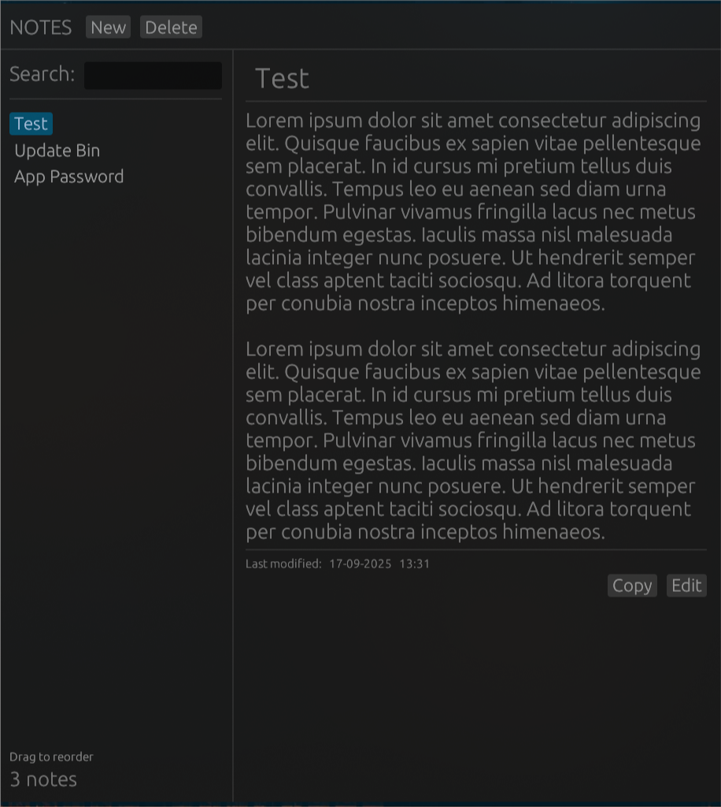

<h1 align="center">NOTES</h1>
<p align="center">
  
</p>

## Description

Simple note taking app written in rust.

## Setup

### From source

clone this repository and build it with cargo

```
git clone https://github.com/MCGirgin/notes.git
cd notes
cargo build --release
```

Then, binary should be in `target/release` folder

### Download from releases page

You can download the app from [releases page](https://github.com/MCGirgin/notes/releases) depending on your system.

## Features

- Local storage
- Drag-drop to reorder notes
- Rich text edit
- Simple ui